<h1 align="center">
  
</h1>

<div align="center">
  
</div>

## 🚀 About Me

```typescript
const buddhi = {
    pronouns: "He" | "Him",
    location: "Hyderabad, India",
    education: "BTech Information Technology @ CVR College of Engineering",
    cgpa: "9.1/10",
    currentFocus: "Full Stack Development & AI/ML",
    askMeAbout: ["Web Dev", "Machine Learning", "DSA", "Competitive Programming"],
    technologies: {
        frontEnd: ["React.js", "JavaScript", "HTML", "CSS"],
        backEnd: ["Python", "Flask", "Express.js", "Node.js"],
        aiMl: ["TensorFlow", "Keras", "Pandas", "NumPy", "OpenCV"],
        databases: ["MongoDB", "MySQL"],
        tools: ["Git", "VSCode", "Jupyter", "Google Colab", "CursorAI"],
        concepts: ["DSA", "OOP", "DBMS", "Neural Networks"]
    },
    currentGoal: "Building scalable software solutions & Contributing to Open Source"
};
```

## 🛠️ Tech Stack

<div align="center">
  
### Languages


### Frontend


### Backend


### AI/ML & Data Science


### Databases & Tools


</div>

## 🚀 Featured Projects

<div align="center">

| Project | Description | Tech Stack | Links |
|---------|-------------|------------|--------|
| 🤖 **AutoML for Everyone** | User-friendly interface for automated machine learning model building | Python, Flask, React.js | [Demo](#) \| [Code](#) |
| 🧠 **Alzheimer's Assist** | AI-powered platform for Alzheimer's patient recognition using facial profiles | Python, React.js, MongoDB | [Demo](#) \| [Code](#) |
| 🧘 **Meditation Support System** | Computer vision system for meditation assistance with emotion detection | Python, OpenCV, PyAudio | [Demo](#) \| [Code](#) |
| 📝 **AI Abstract Generator** | Intelligent document summarization using Gemini API | Python, React.js, Gemini API | [Demo](#) \| [Code](#) |

</div>

## 📊 GitHub Analytics

<div align="center">
  
  
</div>

<div align="center">
  
</div>

<div align="center">
  
</div>

## 🏆 Achievements & Certifications

<div align="center">

### 🎯 Competitive Programming
- 🌟 **LeetCode Top 12.01%** globally
- 🚀 Completed structured **DSA training** through Smart Interviews
- 🏆 **Top 7th team** in GDG Campus Solution Challenge Hackathon

### 📜 Certifications
- 🤖 Machine Learning Specialization
- 📊 Data Science Fundamentals  
- 🧠 Deep Learning & Neural Networks
- ☁️ Cloud Computing Basics
- 🔒 Cybersecurity Fundamentals

</div>

## 💡 What I'm Up To

```mermaid
graph LR
    A[🎓 Learning] --> B[🤖 AI/ML Projects]
    B --> C[💻 Full Stack Apps]
    C --> D[🚀 Open Source]
    D --> E[🏆 Competitions]
    E --> A
```

<div align="center">
  


</div>

- 🔭 Currently working on **Advanced AI/ML projects**
- 🌱 Learning **Cloud Technologies** and **DevOps**
- 👯 Looking to collaborate on **Open Source projects**
- 🤔 Seeking opportunities in **Software Development** roles
- 💬 Ask me about **React, Python, Machine Learning, DSA**
- ⚡ Fun fact: I love solving complex algorithms and building user-centric applications

## 🌐 Connect With Me

<div align="center">

[](https://linkedin.com/in/yourprofile)
[](https://github.com/YourGitHubUsername)
[](mailto:vinaykumarbuddhi333@gmail.com)
[](https://leetcode.com/yourprofile)

</div>

## 📈 Contribution Graph

<div align="center">
  
</div>

## 🎵 Currently Vibing To

<div align="center">
  
</div>

---

<div align="center">
  
  
  ### 💖 Thanks for visiting! Let's build something amazing together! 
  
   <em><b>I love connecting with different people</b> so if you want to say <b>hi, I'll be happy to meet you more!</b> 😊</em>
</div>
