<h1 align="center">
  
</h1>

<div align="center">
  
</div>

## 🚀 About Me

```typescript
const buddhi = {
    pronouns: "He" | "Him",
    location: "Hyderabad, India",
    education: "BTech Cse(AI&ML) @ CVR College of Engineering (2022-2026)",
    cgpa: "9.1/10",
    currentFocus: "Full Stack Development & AI/ML",
    phone: "+91 8919937820",
    askMeAbout: ["Web Dev", "Machine Learning", "DSA", "Competitive Programming"],
    technologies: {
        languages: ["Python", "JavaScript"],
        frontEnd: ["React.js", "HTML", "CSS"],
        backEnd: ["MongoDB", "SQL", "Node.js", "Express.js"],
        aiMl: ["Neural Networks", "TensorFlow", "Keras", "Pandas", "NumPy", "OpenCV", "FER", "PyAudio"],
        tools: ["VSCode", "Jupyter", "Git", "Google Colab", "CursorAI", "YOLO", "PyTesseract"],
        concepts: ["DSA", "OOP", "OS", "DBMS", "Problem Solving"]
    },
    currentGoal: "Building scalable software solutions & Growing as a Software Development Engineer"
};
```

## 🛠️ Tech Stack

<div align="center">
  
### Languages


### Frontend


### Backend


### AI/ML & Data Science


### Databases & Tools


</div>

## 🚀 Featured Projects

<div align="center">

| Project | Description | Tech Stack | Links |
|---------|-------------|------------|--------|
| 🤖 **AutoML for Everyone** | Simplified AutoML web application designed to democratize machine learning model building for non-coders | Python, Flask, React.js | [Code](https://github.com/VinayKumarBuddhi/AutomatedML/tree/master) |
| 🧠 **Alzheimer's Assist** | AI-powered platform that helps Alzheimer's patients recognize loved ones using family profiles with photos and facial recognition | Python, Facial Recognition, React.js, Express.js, MongoDB | [Code](https://github.com/VinayKumarBuddhi/Alzheimers-sAssist) |
| 🧘 **Meditation Support System** | Computer vision system to aid meditation focus using eye tracking, emotion detection, and ambient noise monitoring for ADHD/ASD patients | Python, FER, NumPy, PyAudio, OpenCV | [Code](#) |
| 📝 **AI Flashcard Generator** | Summarizing key concepts from PDFs, Word docs into structured flashcards using Gemini API | Python, React.js, Gemini API | [Code](https://github.com/VinayKumarBuddhi/ai-generated-flash-cards) |
| 👁️ **AR Vision for the Blind** | Assistive vision system using YOLO, Tesseract OCR, and PyTTSx3 for real-time object detection and voice-controlled navigation | Python, OpenCV, YOLO, PyTesseract | [Code](https://github.com/VinayKumarBuddhi/project-vision) |

</div>

## 📊 GitHub Analytics

<div align="center">
  
  
</div>

<div align="center">
  
</div>

<div align="center">
  
</div>

## 🏆 Achievements & Certifications

<div align="center">

### 🎯 Competitive Programming
- 🌟 **LeetCode Top 12.01%** globally
- 🚀 Completed structured **DSA training** through Smart Interviews with [SmartCoder Diamond Certification](https://smartinterviews.in/certificate/22da1207)
- 🏆 **Top 7th team** in GDG Campus Solution Challenge Hackathon

### 📜 Certifications
- 🤖 [Machine Learning Specialization - Coursera](https://drive.google.com/file/d/1-jcwuGOqq3IUwVg7VzGmgCshQF55y8YQ/view?usp=sharing) (Jan 2025)
- 🧠 [Advanced Learning Algorithms - Coursera](https://drive.google.com/file/d/1WbLty3Ol_RX3wRZxpKpmEWk9gLFHiIMQ/view?usp=sharing) (Jan 2025)
- 🔬 [Unsupervised Learning & Reinforcement Learning - Coursera](https://drive.google.com/file/d/1IjuVg2CXoMQyP75zRP405hGUPW0WqKyb/view?usp=sharing) (Jan 2025)
- 🗄️ [Database Programming with SQL - Oracle Academy](https://drive.google.com/file/d/1JJ9o0-iufGKPHwPZ8bYSH9wzWQCJdAnZ/view?usp=sharing) (May 2024)
- 🤖 [AI-ML Virtual Internship - Google for Developers](https://drive.google.com/file/d/10u8_yAdfd2D0xV-AtQHjgep7Bk6X5hA2/view?usp=sharing) (Jul-Sep 2024)
- 📊 [Data Science Master Virtual Internship - ALTAIR](https://drive.google.com/file/d/1sBd4UjtTGiZH_3YATV9T6foFzgOV5jCv/view?usp=sharing) (Feb-Mar 2025)
- 🐍 [Pandas Certification - Kaggle](https://drive.google.com/file/d/1BxXCusfJyukHMxscBB8EO4NiPm8fxPb5/view?usp=sharing) (Dec 2022)
- 🍃 [MongoDB for Students Certification](https://ti-user-certificates.s3.amazonaws.com/ae62dcd7-abdc-4e90-a570-83eccba49043/2fb4a221-7dd8-498e-b7c0-1b7406730788-vinay-kumar-buddhi-21efa6e1-6738-49c9-a4a2-58dd9b4c34e1-certificate.pdf) (2025)

</div>

## 💡 What I'm Up To

```mermaid
graph LR
    A[🎓 Learning] --> B[🤖 AI/ML Projects]
    B --> C[💻 Full Stack Apps]
    C --> D[🚀 Open Source]
    D --> E[🏆 Competitions]
    E --> A
```

<div align="center">
  


</div>

- 🔭 Currently working on **Advanced AI/ML projects**
- 🌱 Learning **Cloud Technologies** and **DevOps**
- 👯 Looking to collaborate on **Open Source projects**
- 🤔 Seeking opportunities in **Software Development** roles
- 💬 Ask me about **React, Python, Machine Learning, DSA**
- ⚡ Fun fact: I love solving complex algorithms and building user-centric applications

## 🌐 Connect With Me

<div align="center">

[](https://www.linkedin.com/in/vinay-kumar-buddhi-6a27872b0/)
[](https://github.com/VinayKumarBuddhi)
[](mailto:vinaykumarbuddhi333@gmail.com)
[](tel:+918919937820)

</div>

## 📈 Contribution Graph

<div align="center">
  
</div>

---

<div align="center">
  
  
  ### 💖 Thanks for visiting! Let's build something amazing together! 
  
   <em><b>I love connecting with different people</b> so if you want to say <b>hi, I'll be happy to meet you more!</b> 😊</em>
</div>
